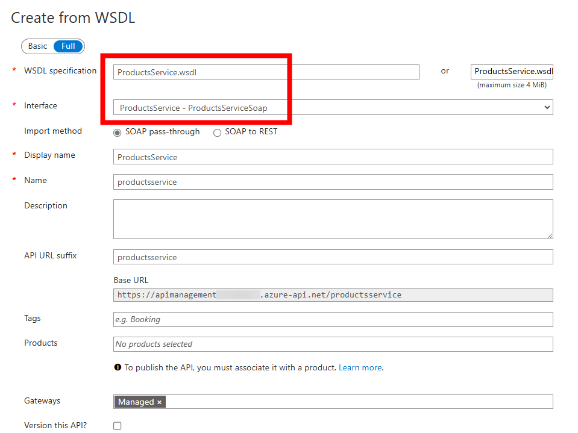
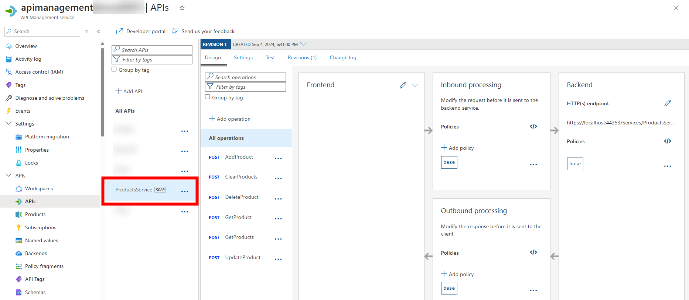
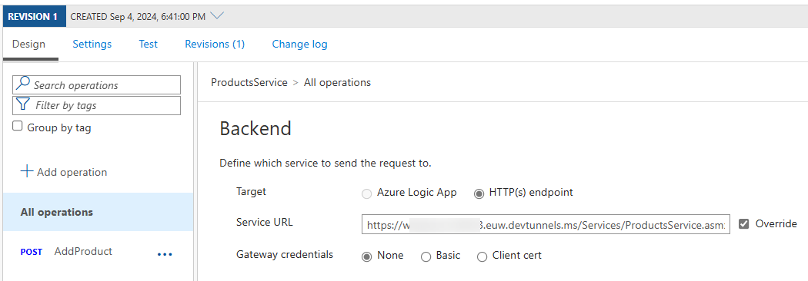
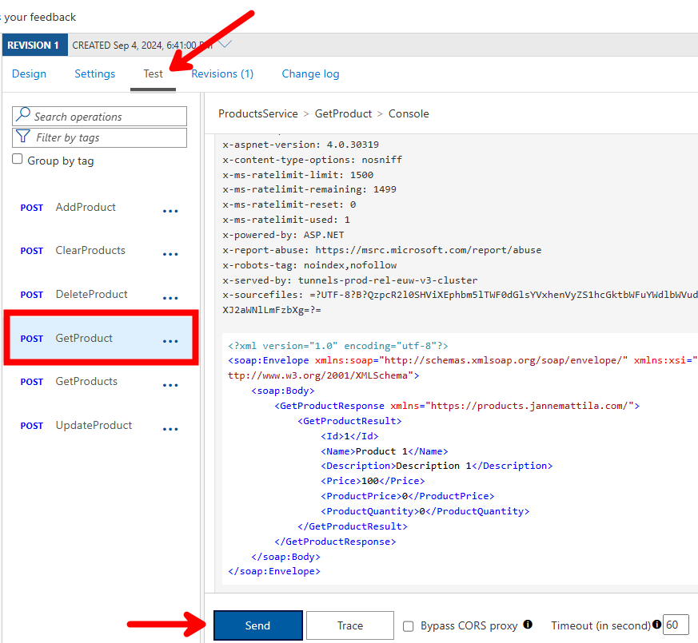
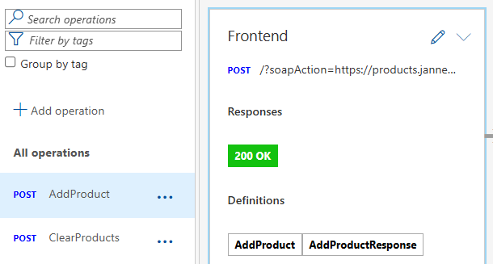
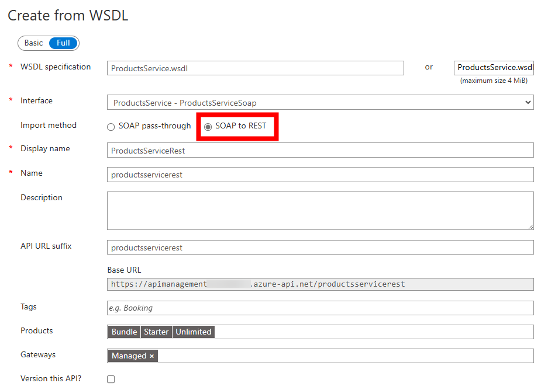
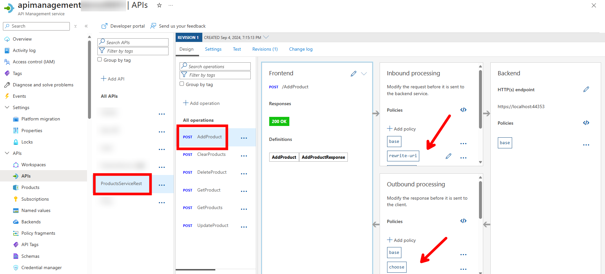
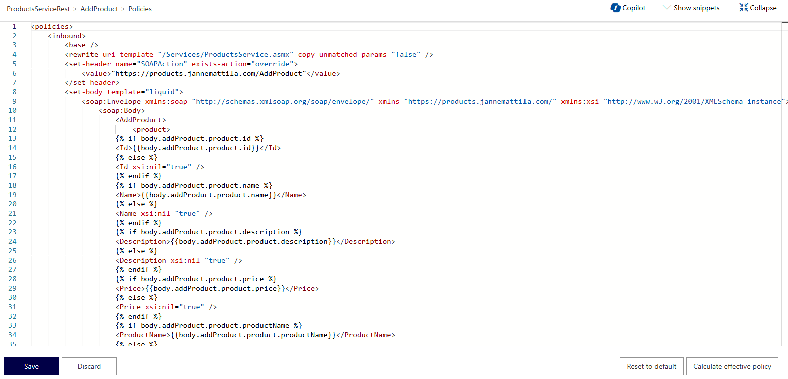
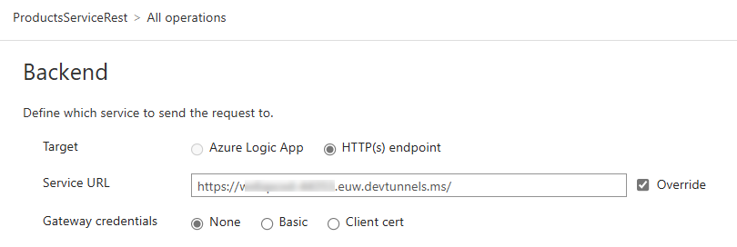
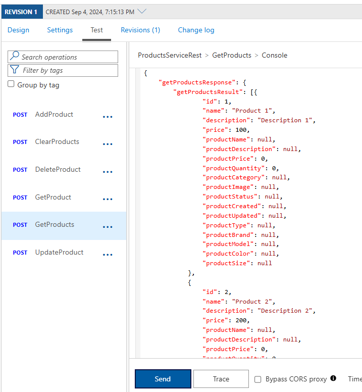

# SOAP

This repo contain simple Web Service implementation for `ProductsService`.
WSDL fils is saved to [ProductsService.wsdl](./ProductsService.wsdl).

## SOAP pass-through

Import to Azure API Management:



SOAP API in Azure API Management:



Expose API using [dev tunnel](https://learn.microsoft.com/en-us/azure/developer/dev-tunnels/get-started?tabs=windows).

Update the url in APIM:



Test the API:



Each method has types defined in APIM:



## SOAP to REST

Import to Azure API Management:



SOAP API in Azure API Management:



APIM Policy to convert SOAP to REST:



`GetProducts` method converted to REST:

```xml
<policies>
    <inbound>
        <base />
        <rewrite-uri template="/Services/ProductsService.asmx" copy-unmatched-params="false" />
        <set-header name="SOAPAction" exists-action="override">
            <value>"https://products.jannemattila.com/GetProducts"</value>
        </set-header>
        <set-body template="liquid">
			<soap:Envelope xmlns:soap="http://schemas.xmlsoap.org/soap/envelope/" xmlns="https://products.jannemattila.com/" xmlns:xsi="http://www.w3.org/2001/XMLSchema-instance">
				<soap:Body>
					<GetProducts>
					</GetProducts>
				</soap:Body>
			</soap:Envelope>
		</set-body>
        <set-header name="Content-Type" exists-action="override">
            <value>text/xml</value>
        </set-header>
    </inbound>
    <backend>
        <base />
    </backend>
    <outbound>
        <base />
        <choose>
            <when condition="@(context.Response.StatusCode < 400)">
                <set-body template="liquid">
        {
            "getProductsResponse": 
            {
                "getProductsResult": 
                [
                    
                    {
                        "id": {{item.Id}} null ,
                        "name": "{{item.Name | Replace: '\r', '\r' | Replace: '\n', '\n' | Replace: '([^\\](\\\\)*)"', '$1\"'}}" null ,
                        "description": "{{item.Description | Replace: '\r', '\r' | Replace: '\n', '\n' | Replace: '([^\\](\\\\)*)"', '$1\"'}}" null ,
                        "price": {{item.Price}} null ,
                        "productName": "{{item.ProductName | Replace: '\r', '\r' | Replace: '\n', '\n' | Replace: '([^\\](\\\\)*)"', '$1\"'}}" null ,
                        "productDescription": "{{item.ProductDescription | Replace: '\r', '\r' | Replace: '\n', '\n' | Replace: '([^\\](\\\\)*)"', '$1\"'}}" null ,
                        "productPrice": {{item.ProductPrice}} null ,
                        "productQuantity": {{item.ProductQuantity}} null ,
                        "productCategory": "{{item.ProductCategory | Replace: '\r', '\r' | Replace: '\n', '\n' | Replace: '([^\\](\\\\)*)"', '$1\"'}}" null ,
                        "productImage": "{{item.ProductImage | Replace: '\r', '\r' | Replace: '\n', '\n' | Replace: '([^\\](\\\\)*)"', '$1\"'}}" null ,
                        "productStatus": "{{item.ProductStatus | Replace: '\r', '\r' | Replace: '\n', '\n' | Replace: '([^\\](\\\\)*)"', '$1\"'}}" null ,
                        "productCreated": "{{item.ProductCreated | Replace: '\r', '\r' | Replace: '\n', '\n' | Replace: '([^\\](\\\\)*)"', '$1\"'}}" null ,
                        "productUpdated": "{{item.ProductUpdated | Replace: '\r', '\r' | Replace: '\n', '\n' | Replace: '([^\\](\\\\)*)"', '$1\"'}}" null ,
                        "productType": "{{item.ProductType | Replace: '\r', '\r' | Replace: '\n', '\n' | Replace: '([^\\](\\\\)*)"', '$1\"'}}" null ,
                        "productBrand": "{{item.ProductBrand | Replace: '\r', '\r' | Replace: '\n', '\n' | Replace: '([^\\](\\\\)*)"', '$1\"'}}" null ,
                        "productModel": "{{item.ProductModel | Replace: '\r', '\r' | Replace: '\n', '\n' | Replace: '([^\\](\\\\)*)"', '$1\"'}}" null ,
                        "productColor": "{{item.ProductColor | Replace: '\r', '\r' | Replace: '\n', '\n' | Replace: '([^\\](\\\\)*)"', '$1\"'}}" null ,
                        "productSize": "{{item.ProductSize | Replace: '\r', '\r' | Replace: '\n', '\n' | Replace: '([^\\](\\\\)*)"', '$1\"'}}" null 
                    }
                    
                ]
            }
        }</set-body>
            </when>
            <otherwise>
                <set-variable name="old-body" value="@(context.Response.Body.As<string>(preserveContent: true))" />
                <!-- Error response as per https://github.com/Microsoft/api-guidelines/blob/master/Guidelines.md#7102-error-condition-responses -->
                <set-body template="liquid">{
            "error": {
                "code": "{{body.envelope.body.fault.faultcode}}",
                "message": "{{body.envelope.body.fault.faultstring}}"
            }
        }</set-body>
                <choose>
                    <when condition="@(string.IsNullOrEmpty(context.Response.Body.As<JObject>(preserveContent: true)["error"]["code"].ToString()) && string.IsNullOrEmpty(context.Response.Body.As<JObject>(preserveContent: true)["error"]["message"].ToString()))">
                        <set-body>@{
                    var newResponseBody = new JObject();
                    newResponseBody["error"] = new JObject();
                    newResponseBody["error"]["code"] = "InvalidErrorResponseBody";
                    if (string.IsNullOrEmpty((string)context.Variables["old-body"]))
                    {
                        newResponseBody["error"]["message"] = "The error response body was not a valid SOAP error response. The response body was empty.";
                    }
                    else
                    {
                        newResponseBody["error"]["message"] = "The error response body was not a valid SOAP error response. The response body was: '" + context.Variables["old-body"] + "'.";
                    }
                    return newResponseBody.ToString();
                }</set-body>
                    </when>
                </choose>
            </otherwise>
        </choose>
        <set-header name="Content-Type" exists-action="override">
            <value>application/json</value>
        </set-header>
    </outbound>
    <on-error>
        <base />
    </on-error>
</policies>
```

Update the url in APIM (note the path!):



Test the API:


